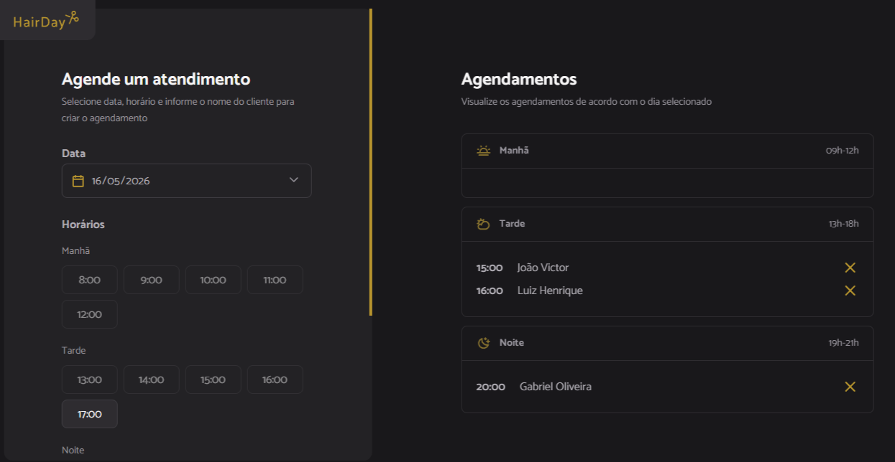

# ✂️ HairDay - Barbershop Booking

## 📌 Sobre o projeto

O **HairDay** é uma aplicação web de agendamento para barbearias, 
desenvolvida com foco na consolidação de conhecimentos adquiridos 
no módulos de JavaScript antes do framework na Rocketseat.

O sistema permite:

- visualizar horários disponíveis
- criar agendamentos
- listar agendamentos do dia
- cancelar agendamentos

Além do frontend, o projeto também conta com uma API simulada utilizando **JSON Server**, 
integrada a um servidor **Express**, simulando uma aplicação full stack real.

---

## 🚀 Deploy Online

O projeto foi publicado utilizando Render.

### Estrutura do deploy:
- Front-end servido via Express
- API simulada integrada com JSON Server
- Build realizado com Webpack

🔗 Acesse o projeto online:

https://barbershop-booking-90iz.onrender.com/

---

## 📸 Preview

### Tela principal



---

## 🛠️ Tecnologias utilizadas

### Frontend

- JavaScript ES6+
- HTML5
- CSS3
- Day.js

### Build e Ferramentas

- Webpack
- Babel
- Webpack Dev Server
- HtmlWebpackPlugin
- CopyWebpackPlugin

### Backend / API

- Node.js
- Express
- JSON Server

### Deploy

- Render

---

## ⚙️ Funcionalidades

- ✅ Listagem de horários disponíveis
- ✅ Separação por períodos (Manhã, Tarde e Noite)
- ✅ Criação de agendamentos
- ✅ Cancelamento de agendamentos
- ✅ Integração com API
- ✅ Atualização dinâmica da interface
- ✅ Verificação de horários passados
- ✅ Bloqueio de horários já reservados
- ✅ Filtragem de agendamentos por data
- ✅ Organização modular do projeto

---

## 🧠 Conceitos praticados

Durante o desenvolvimento deste projeto, foram aplicados conceitos importantes como:

- Modularização de código
- Manipulação de DOM
- Eventos
- Async/Await
- Fetch API
- Integração com APIs
- Estruturação de serviços
- Build de aplicações com Webpack
- Configuração de ambiente de desenvolvimento
- Deploy de aplicações full stack
- Organização de arquitetura frontend
- Tratamento de erros
- Estruturação de rotas com Express

---

## 🌐 API

A aplicação utiliza uma **API simulada** com **JSON Server**.

### Rotas disponíveis

#### Listar agendamentos

```http
GET /api/schedules
```

#### Criar agendamento

```http
POST /api/schedules
```

#### Cancelar agendamento

```http
DELETE /api/schedules/:id
```

---

## 🎯 Objetivo do projeto

Este projeto foi desenvolvido com foco em:

- consolidar fundamentos avançados de JavaScript
- praticar arquitetura modular
- compreender fluxo de build
- simular um ambiente frontend + backend
- praticar deploy de aplicações web
